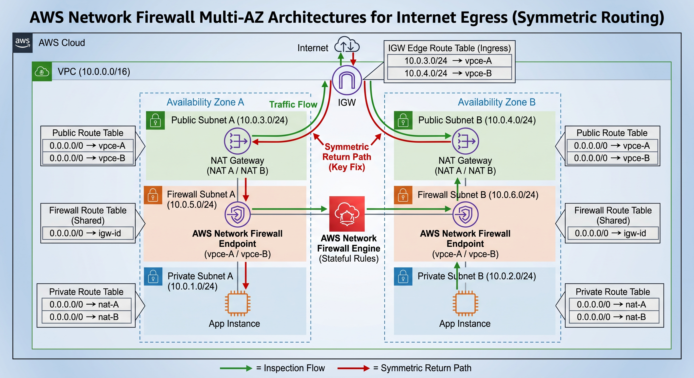

# AWS Network Firewall: NAT-before-Firewall Routing Tables

**Architecture Variables:**
* **VPC CIDR:** `10.0.0.0/16`
* **AZ-A Subnets:** Private A (`10.0.1.0/24`), Public A (`10.0.3.0/24`), Firewall A (`10.0.5.0/24`)
* **AZ-B Subnets:** Private B (`10.0.2.0/24`), Public B (`10.0.4.0/24`), Firewall B (`10.0.6.0/24`)

### 1. IGW Edge Route Table (Ingress)
**Associated Resource:** Internet Gateway (`igw-id`) via Edge Association.
**Description:** Intercepts return traffic from the internet destined for the NAT Gateways and forces it symmetrically through the respective AZ's Firewall Endpoint.

| Destination | Target | Route Type | Documentation Note |
| :--- | :--- | :--- | :--- |
| `10.0.3.0/24` | `vpce-A` (FW Endpoint AZ-A) | Static | Forces return traffic for NAT A through Firewall A. |
| `10.0.4.0/24` | `vpce-B` (FW Endpoint AZ-B) | Static | Forces return traffic for NAT B through Firewall B. |
| `10.0.0.0/16` | `local` | Default | Standard VPC local routing. |

### 2. Public Subnet A Route Table
**Associated Subnet:** Public Subnet A (`10.0.3.0/24`)
**Description:** Governs outbound traffic from NAT Gateway A, routing it to the Firewall Endpoint in AZ-A for inspection before it reaches the internet.

| Destination | Target | Route Type | Documentation Note |
| :--- | :--- | :--- | :--- |
| `10.0.0.0/16` | `local` | Default | Allows intra-VPC communication. |
| `0.0.0.0/0` | `vpce-A` (FW Endpoint AZ-A) | Static | Intercepts NAT A's outbound internet traffic. |

### 3. Public Subnet B Route Table
**Associated Subnet:** Public Subnet B (`10.0.4.0/24`)
**Description:** Governs outbound traffic from NAT Gateway B, routing it to the Firewall Endpoint in AZ-B for inspection.

| Destination | Target | Route Type | Documentation Note |
| :--- | :--- | :--- | :--- |
| `10.0.0.0/16` | `local` | Default | Allows intra-VPC communication. |
| `0.0.0.0/0` | `vpce-B` (FW Endpoint AZ-B) | Static | Intercepts NAT B's outbound internet traffic. |

### 4. Firewall Subnet Route Table (Shared)
**Associated Subnets:** Firewall Subnet A (`10.0.5.0/24`) & Firewall Subnet B (`10.0.6.0/24`)
**Description:** Provides the final egress path to the internet for traffic that has successfully passed stateful inspection. Both AZs can share this table.

| Destination | Target | Route Type | Documentation Note |
| :--- | :--- | :--- | :--- |
| `10.0.0.0/16` | `local` | Default | Delivers inspected inbound traffic to the NAT Gateways. |
| `0.0.0.0/0` | `igw-id` (Internet Gateway) | Static | Pushes inspected outbound traffic to the public internet. |

### 5. Private Subnet A Route Table
**Associated Subnet:** Private Subnet A (`10.0.1.0/24`)
**Description:** Routes outbound requests from workloads in AZ-A to the local NAT Gateway in AZ-A to begin the egress flow.

| Destination | Target | Route Type | Documentation Note |
| :--- | :--- | :--- | :--- |
| `10.0.0.0/16` | `local` | Default | Allows intra-VPC communication. |
| `0.0.0.0/0` | `nat-A` (NAT Gateway AZ-A) | Static | Routes internet-bound traffic to the AZ-A NAT Gateway. |

### 6. Private Subnet B Route Table
**Associated Subnet:** Private Subnet B (`10.0.2.0/24`)
**Description:** Routes outbound requests from workloads in AZ-B to the local NAT Gateway in AZ-B.

| Destination | Target | Route Type | Documentation Note |
| :--- | :--- | :--- | :--- |
| `10.0.0.0/16` | `local` | Default | Allows intra-VPC communication. |
| `0.0.0.0/0` | `nat-B` (NAT Gateway AZ-B) | Static | Routes internet-bound traffic to the AZ-B NAT Gateway. |

